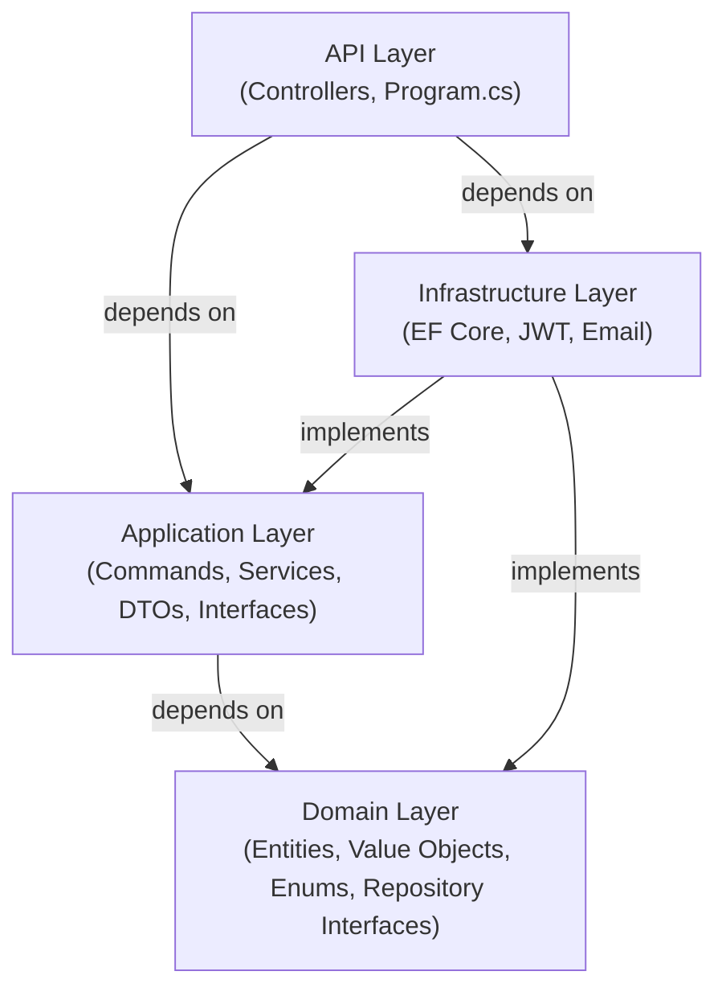
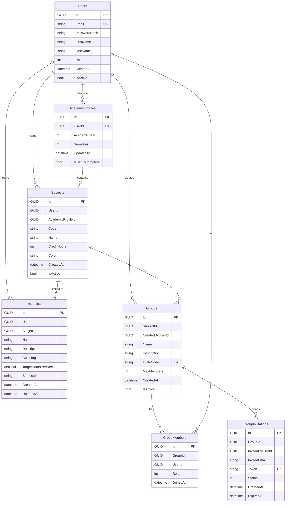
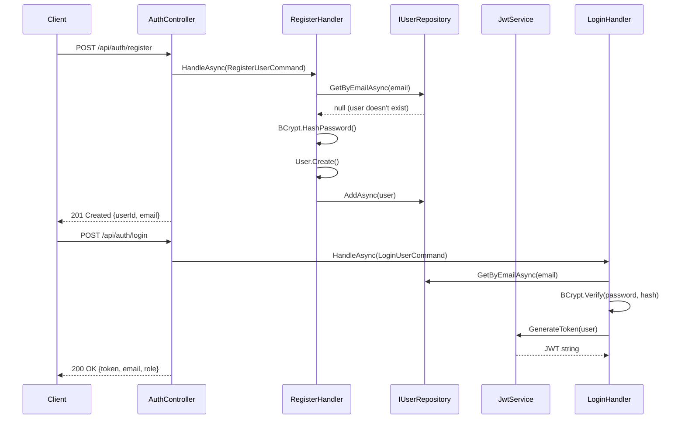
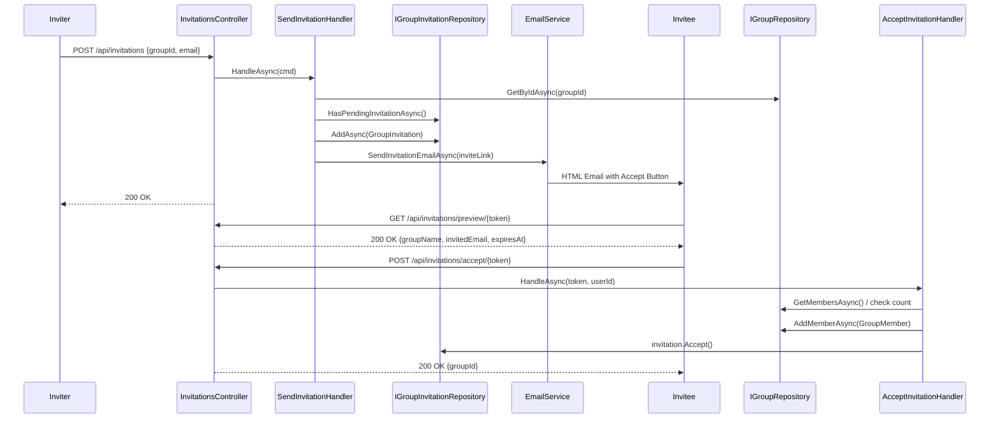

# LoadMate

Student workload, goals, and group collaboration platform: subjects and course modules, team workspaces with chat, shared files, a real-time whiteboard, email invitations, a Gemini-backed workspace assistant, and n8n-powered parsing of assignment documents into goal drafts.

[](LICENSE)
[](https://dotnet.microsoft.com/)
[](https://react.dev/)
[](https://github.com/sakith03/student-workload-management-system/actions/workflows/ci.yml)

## Overview

LoadMate helps students organize coursework into **subjects** and **goals** (course modules with step-by-step guidance and deadlines), track completion, and collaborate in **subject-scoped workspaces**: invite members, chat, upload shared files, and sketch on a **SignalR** whiteboard. A per-workspace **chatbot** uses the Google **Gemini** API, and uploading briefs (PDF/DOC/DOCX) can pre-fill goals via an external **n8n** workflow.

The backend is a **modular monolith** with **DDD-style** layering: `StudentWorkload.Domain`, `Application`, `Infrastructure`, and `API`. The API is **ASP.NET Core 8**, **Entity Framework Core** against **SQL Server**, **JWT** authentication, **Swagger** in Development, automatic EF **migrations** on startup, and a **`/health`** endpoint for monitoring.

The frontend is **React 19** with **Vite 7**, **Tailwind CSS**, **Axios**, and **SignalR** for the whiteboard hub.

## Live demo

- **App:** [https://frontend-loadmate-h5h2gghtascvcnay.centralindia-01.azurewebsites.net/login](https://frontend-loadmate-h5h2gghtascvcnay.centralindia-01.azurewebsites.net/login)
- **API health:** [https://backend-loadmate-b3ezg2behsgyerbw.centralindia-01.azurewebsites.net/health](https://backend-loadmate-b3ezg2behsgyerbw.centralindia-01.azurewebsites.net/health)

## Screenshot

Add a capture as `docs/screenshot.png` (create `docs/` if needed), then uncomment or replace:

```markdown

```

## Features

| Area | Capabilities |
|------|----------------|
| **Auth** | Register, login, JWT; `me`; admin-only route (`AuthController`) |
| **Academic** | Academic year/semester profile; add/list subjects (`AcademicController`) |
| **Goals / modules** | CRUD course modules; manual goals with steps; patch step completions; mark complete (`ModulesController`) |
| **Workspaces** | Create/update/delete groups; list by subject; “my” groups; members; pending invitations (`GroupsController`) |
| **Invitations** | Email invite; public preview by token; accept when logged in (`InvitationsController`) |
| **Chat** | Group message list and send (`GroupChatController`) |
| **Files** | List, upload (50 MB), download; storage path override via env (`GroupFilesController`) |
| **Whiteboard** | Persisted state over REST; live strokes via SignalR `/hubs/whiteboard` (JWT may be passed as `access_token` query) |
| **Chatbot** | Initialize session, send message (Gemini), history (`ChatbotController`) |
| **Document AI** | `POST api/goals/parse-document` — PDF/DOC/DOCX (10 MB) to n8n webhook (`GoalParserController`) |

## Tech stack

| Layer | Technology | Notes |
|--------|------------|--------|
| API | ASP.NET Core 8 (`net8.0`) | JWT Bearer 8.0, SignalR, Swashbuckle 6.6.2, EF Core tools 8.0 |
| Data | SQL Server | **Runtime:** `UseSqlServer` in `Program.cs`. Local Docker: `mcr.microsoft.com/mssql/server:2022-latest`. Pomelo MySQL package is referenced in Infrastructure but not used at startup. |
| Frontend | React 19, Vite 7, React Router 7, Tailwind 3, Axios, `@microsoft/signalr` | See `frontend/package.json` |
| Tests | xUnit, Moq, FluentAssertions, Coverlet | `backend/tests/*` |
| CI | GitHub Actions | `docker compose` build/up, health check, `dotnet test` |
| CD | Docker Hub + Azure Web Apps | Images `myapp-backend` / `myapp-frontend`; rollback to `:previous` on failed health check |

## Repository layout

```
student-workload-management-system/
├── backend/
│   ├── StudentWorkload.sln
│   ├── src/
│   │   ├── StudentWorkload.API/          # Controllers, SignalR hub, Program.cs
│   │   ├── StudentWorkload.Application/ # Commands, handlers, DTOs, services
│   │   ├── StudentWorkload.Domain/       # Entities, repository interfaces
│   │   └── StudentWorkload.Infrastructure/ # EF Core, repositories, email/JWT
│   └── tests/
│       ├── StudentWorkload.UnitTests/
│       └── StudentWorkload.IntegrationTests/
├── frontend/                 # Vite + React (JSX), nginx in Docker
├── StudentWorkload/          # Project analysis / documentation (e.g. LoadMate_Full_Analysis.md)
├── tests/jmeter/             # JMeter scenarios (invitation flow); see tests/jmeter/README.md
├── .github/workflows/        # ci.yml, cd.yml
├── docker-compose.yml        # MSSQL + API + frontend (dev)
├── docker-compose.production.yml  # Pre-built images
├── .env.example
└── LICENSE
```

## Prerequisites

- [.NET SDK 8.0](https://dotnet.microsoft.com/download)
- [Node.js](https://nodejs.org/) 18+ (CI uses 18; frontend Docker build uses Node 20)
- [Docker](https://docs.docker.com/get-docker/) and Docker Compose (recommended for full stack)

## Getting started

### 1. Clone and environment

```bash
git clone https://github.com/sakith03/student-workload-management-system.git
cd student-workload-management-system
cp .env.example .env
```

Edit `.env` with strong `DB_PASSWORD`, `JWT_SECRET`, email credentials, and optionally `GEMINI_API_KEY` for the chatbot.

### 2. Run with Docker Compose

```bash
docker compose up -d
```

| Service | URL / port |
|---------|------------|
| API (host) | `http://localhost:5000` → container `8080` |
| Frontend | `http://localhost:3000` (nginx) |
| SQL Server | `localhost:1433` |

Add `GEMINI_API_KEY` to `.env` if you use the chatbot (mapped to `Gemini__ApiKey` in compose).

### 3. API only (local dotnet)

Set `ConnectionStrings__DefaultConnection` (and `JwtSettings__Secret`, etc.) via environment variables or user secrets, then:

```bash
cd backend/src/StudentWorkload.API
dotnet run
```

With the default **http** profile, Swagger is at `http://localhost:5191/swagger` when `ASPNETCORE_ENVIRONMENT=Development` (`launchSettings.json`).

### 4. Frontend only (Vite)

```bash
cd frontend
npm install
npm run dev
```

Dev server: `http://localhost:5173`. CORS allows `5173` and `3000`.

Optional API base (defaults to `http://localhost:5000/api` if unset):

```bash
# PowerShell
$env:VITE_API_URL = "http://localhost:5191"
npm run dev
```

Production build:

```bash
cd frontend
npm ci
npm run build
```

Docker build for frontend uses build arg `VITE_API_URL` (see `frontend/Dockerfile`).

## Configuration

| Variable / setting | Description |
|--------------------|-------------|
| `DB_PASSWORD` | SQL Server `sa` password (Docker Compose) |
| `ConnectionStrings__DefaultConnection` | Full SQL Server connection string |
| `JWT_SECRET` / `JwtSettings__Secret` | Symmetric key for signing JWTs (use a long, random secret) |
| `JwtSettings__Issuer`, `JwtSettings__Audience`, `JwtSettings__ExpirationMinutes` | JWT validation |
| `EMAIL_*` / `EmailSettings__*` | SMTP (e.g. Gmail) for invitations |
| `GEMINI_API_KEY` / `Gemini__ApiKey` | Google Gemini API key |
| `N8n__BaseUrl` | n8n base URL; webhook path used: `/webhook/parse-assignment` |
| `AppSettings__FrontendBaseUrl` | Base URL for invitation links in emails |
| `WORKSPACE_FILES_PATH` | Optional directory root for group file storage |
| `VITE_API_URL` | Frontend build-time API origin |

See `.env.example` and `appsettings.Development.json` for examples.

## API quick reference

Base URL: `/api` (except `/health` and `/hubs/whiteboard`). Most routes require `Authorization: Bearer <token>`.

- **Auth:** `POST .../auth/register`, `POST .../auth/login`, `GET .../auth/me`, `GET .../auth/admin-only`
- **Academic:** `POST/GET .../academic/profile`, `POST/GET .../academic/subjects`
- **Modules:** `GET|POST .../modules`, `POST .../modules/manual`, `PUT|DELETE .../modules/{id}`, `PATCH .../modules/{id}/completions`, `PATCH .../modules/{id}/complete`
- **Groups:** `POST .../groups`, `GET .../groups/{id}`, `GET .../groups/subject/{subjectId}`, `GET .../groups/my`, `PUT|DELETE .../groups/{id}`, `GET .../groups/{groupId}/members`, `GET .../groups/{groupId}/pending-invitations`
- **Invitations:** `POST .../invitations`, `GET .../invitations/preview/{token}`, `POST .../invitations/accept/{token}`
- **Group chat:** `GET|POST .../groupchat/{groupId}/messages`
- **Files:** `GET|POST .../groups/{groupId}/files`, `GET .../groups/{groupId}/files/{fileId}/download`
- **Whiteboard state:** `GET .../groups/{groupId}/whiteboard/state`
- **Chatbot:** `POST .../chatbot/initialize`, `POST .../chatbot/message`, `GET .../chatbot/history/{sessionId}`
- **Goals / parse:** `POST .../goals/parse-document` (multipart file)
- **Health:** `GET /health` → `Healthy`
- **SignalR:** `/hubs/whiteboard`

## Testing

```bash
# Backend (unit + integration)
dotnet test ./backend --logger "trx;LogFileName=test_results.trx"

# Frontend lint
cd frontend && npm run lint
```

Load testing / invitation flows: [tests/jmeter/README.md](tests/jmeter/README.md).

## Deployment

- **CI:** On push/PR to `main` or `develop` — Node install, `docker compose build` / `up`, wait for `http://localhost:5000/health`, `docker compose down`, `dotnet test` (`.github/workflows/ci.yml`).
- **CD:** On push to `main` or `develop` — build/push Docker images, deploy to Azure Web Apps, health check with rollback to `:previous` images, optional Slack (`.github/workflows/cd.yml`).

**Publish API (example):**

```bash
dotnet publish backend/src/StudentWorkload.API/StudentWorkload.API.csproj -c Release -o ./publish
```

## Contributing

1. Fork the repo and branch from `main` or `develop`.
2. Use [.github/pull_request_template.md](.github/pull_request_template.md) for PRs.
3. Keep CI green; run `npm run lint` for frontend changes.

## License

[MIT](LICENSE) — Copyright (c) 2026 Sakith Abeywickrama.

## Further reading

- In-depth analysis: [StudentWorkload/LoadMate_Full_Analysis.md](StudentWorkload/LoadMate_Full_Analysis.md)
# LoadMate — Student Workload Management System
## Full Technical Analysis Document

> **Generated:** 2026-03-03 | **Language/Runtime:** C# / .NET 8 | **Database:** MySQL (via EF Core)

---

## Table of Contents

1. [Project Overview](#1-project-overview)
2. [Technology Stack](#2-technology-stack)
3. [Solution Structure](#3-solution-structure)
4. [Architecture — Clean Architecture](#4-architecture--clean-architecture)
5. [Domain Layer — Entities & Value Objects](#5-domain-layer--entities--value-objects)
6. [Application Layer — Use Cases & Services](#6-application-layer--use-cases--services)
7. [Infrastructure Layer](#7-infrastructure-layer)
8. [API Layer — Controllers & Endpoints](#8-api-layer--controllers--endpoints)
9. [Database Schema & Migrations](#9-database-schema--migrations)
10. [Authentication & Security](#10-authentication--security)
11. [Email Service](#11-email-service)
12. [Testing Strategy](#12-testing-strategy)
13. [Docker & Deployment](#13-docker--deployment)
14. [Configuration & Environment Variables](#14-configuration--environment-variables)
15. [Data Flow Diagrams](#15-data-flow-diagrams)
16. [Known Issues & Observations](#16-known-issues--observations)
17. [Improvement Recommendations](#17-improvement-recommendations)

---

## 1. Project Overview

**LoadMate** is a backend REST API for a **Student Workload Management System**. It allows:

- Students, Lecturers, and Admins to register and authenticate
- Students to set up their **Academic Profile** (year + semester)
- Students to manage their enrolled **Subjects** (modules they study)
- Students to track **Course Modules** (workload planning entries with target hours per week)
- Students to form **Groups** per subject and **invite** other students via email
- Group members to **accept invitations** and join workspaces

The system is named **LoadMate** (branding visible through email templates and app identity).

---

## 2. Technology Stack

| Layer | Technology |
|---|---|
| Runtime | .NET 8 (C#) |
| Web Framework | ASP.NET Core Web API |
| ORM | Entity Framework Core 8 |
| Database | MySQL (Pomelo.EntityFrameworkCore.MySql 8.0.2) |
| Authentication | JWT Bearer (Microsoft.AspNetCore.Authentication.JwtBearer 8.0.0) |
| API Documentation | Swagger / Swashbuckle (6.6.2) |
| Email | System.Net.Mail (SMTP — Gmail configurable) |
| JWT Utilities | System.IdentityModel.Tokens.Jwt 8.16.0 |
| Unit Testing | xUnit 2.5.3 + Moq 4.20.72 + FluentAssertions 8.8.0 |
| Test Coverage | coverlet.collector 6.0.0 |
| Containerization | Docker (multi-stage, ASP.NET 8 runtime image) |

---

## 3. Solution Structure

```
StudentWorkload.sln
├── src/
│   ├── StudentWorkload.Domain          # Enterprise business rules
│   ├── StudentWorkload.Application     # Use case orchestration
│   ├── StudentWorkload.Infrastructure  # EF Core, JWT, Email
│   └── StudentWorkload.API             # Controllers, Startup, Dockerfile
└── tests/
    ├── StudentWorkload.UnitTests       # Service + entity unit tests
    └── StudentWorkload.IntegrationTests# (scaffolded, currently empty)
```

### File Count Summary

| Project | C# Files |
|---|---|
| Domain | ~13 |
| Application | ~21 |
| Infrastructure | ~12 |
| API | ~8 |
| UnitTests | ~6+ |

---

## 4. Architecture — Clean Architecture

The project strictly follows **Clean Architecture** (also known as Onion Architecture):



### Dependency Rules
- **Domain** has zero external dependencies (pure C#)
- **Application** only references **Domain** — no infrastructure concerns
- **Infrastructure** implements Application interfaces (`IUserRepository`, [IEmailService](file:///e:/Projects/LoadMate/student-workload-management-system/backend/src/StudentWorkload.Application/Common/Interfaces/IEmailService.cs#6-15), etc.)
- **API** wires everything together via DI in [Program.cs](file:///e:/Projects/LoadMate/student-workload-management-system/backend/src/StudentWorkload.API/Program.cs)

### Key Design Patterns
| Pattern | Usage |
|---|---|
| Repository Pattern | `IUserRepository`, `ICourseModuleRepository`, `IGroupRepository`, etc. |
| Command Pattern | `RegisterUserCommand`, `LoginUserCommand`, `CreateGroupCommand`, [SendInvitationCommand](file:///e:/Projects/LoadMate/student-workload-management-system/backend/src/StudentWorkload.Application/Modules/Groups/Commands/SendInvitation/SendInvitationCommandHandler.cs#11-92), [AcceptInvitationCommand](file:///e:/Projects/LoadMate/student-workload-management-system/backend/src/StudentWorkload.Application/Modules/Groups/Commands/AcceptInvitation/AcceptInvitationCommandHandler.cs#14-21), `SetupAcademicProfileCommand`, `AddSubjectCommand` |
| Factory Method | Every entity uses a static [Create()](file:///e:/Projects/LoadMate/student-workload-management-system/backend/src/StudentWorkload.Domain/Modules/CourseModules/Entities/CourseModule.cs#18-45) method instead of `new` |
| Value Object | [Email](file:///e:/Projects/LoadMate/student-workload-management-system/backend/src/StudentWorkload.Domain/Modules/Users/ValueObjects/Email.cs#5-34) is a value object (validates format, provides equality) |
| Service Layer | [CourseModuleService](file:///e:/Projects/LoadMate/student-workload-management-system/backend/src/StudentWorkload.Application/Modules/CourseModules/Services/CourseModuleService.cs#7-113) orchestrates CRUD on course modules |
| CQRS-lite | Commands have dedicated [CommandHandler](file:///e:/Projects/LoadMate/student-workload-management-system/backend/src/StudentWorkload.Application/Modules/Groups/Commands/SendInvitation/SendInvitationCommandHandler.cs#11-92) classes; reads done via repositories directly |

---

## 5. Domain Layer — Entities & Value Objects

### 5.1 User

**File:** [StudentWorkload.Domain/Modules/Users/Entities/User.cs](file:///e:/Projects/LoadMate/student-workload-management-system/backend/src/StudentWorkload.Domain/Modules/Users/Entities/User.cs)

| Property | Type | Notes |
|---|---|---|
| [Id](file:///e:/Projects/LoadMate/student-workload-management-system/backend/src/StudentWorkload.API/Controllers/InvitationsController.cs#40-42) | `Guid` | Primary key, client-generated |
| [Email](file:///e:/Projects/LoadMate/student-workload-management-system/backend/src/StudentWorkload.Domain/Modules/Users/ValueObjects/Email.cs#5-34) | [Email](file:///e:/Projects/LoadMate/student-workload-management-system/backend/src/StudentWorkload.Domain/Modules/Users/ValueObjects/Email.cs#5-34) | Value Object; unique, lowercase |
| `PasswordHash` | `string` | BCrypt hash |
| `FirstName` | `string` | Max 100 chars |
| `LastName` | `string` | Max 100 chars |
| `Role` | `UserRole` | Enum: `Student=1`, `Lecturer=2`, `Admin=3` |
| [CreatedAt](file:///e:/Projects/LoadMate/student-workload-management-system/backend/tests/StudentWorkload.UnitTests/CourseModuleServiceTests.cs#26-44) | `DateTime` | UTC |
| `IsActive` | `bool` | Default true |

**Domain Behaviors:** [Activate()](file:///e:/Projects/LoadMate/student-workload-management-system/backend/src/StudentWorkload.Domain/Modules/Users/Entities/User.cs#50-51), [Deactivate()](file:///e:/Projects/LoadMate/student-workload-management-system/backend/src/StudentWorkload.Domain/Modules/Users/Entities/User.cs#48-50), `FullName` (computed)

---

### 5.2 AcademicProfile

**File:** [StudentWorkload.Domain/Modules/Academic/Entities/AcademicProfile.cs](file:///e:/Projects/LoadMate/student-workload-management-system/backend/src/StudentWorkload.Domain/Modules/Academic/Entities/AcademicProfile.cs)

| Property | Type | Notes |
|---|---|---|
| [Id](file:///e:/Projects/LoadMate/student-workload-management-system/backend/src/StudentWorkload.API/Controllers/InvitationsController.cs#40-42) | `Guid` | PK |
| [UserId](file:///e:/Projects/LoadMate/student-workload-management-system/backend/src/StudentWorkload.API/Controllers/InvitationsController.cs#40-42) | `Guid` | FK to User (unique — one profile per user) |
| `AcademicYear` | [int](file:///e:/Projects/LoadMate/student-workload-management-system/backend/src/StudentWorkload.API/Controllers/AuthController.cs#74-78) | 1–6 (validated) |
| [Semester](file:///e:/Projects/LoadMate/student-workload-management-system/backend/tests/StudentWorkload.UnitTests/CourseModuleServiceTests.cs#184-194) | [int](file:///e:/Projects/LoadMate/student-workload-management-system/backend/src/StudentWorkload.API/Controllers/AuthController.cs#74-78) | 1 or 2 (validated) |
| [UpdatedAt](file:///e:/Projects/LoadMate/student-workload-management-system/backend/tests/StudentWorkload.UnitTests/CourseModuleServiceTests.cs#352-370) | `DateTime` | UTC |
| `IsSetupComplete` | `bool` | True on creation |

**Business Rule:** Validates AcademicYear (1–6) and Semester (1–2) at the domain level.

---

### 5.3 Subject

**File:** [StudentWorkload.Domain/Modules/Subjects/Entities/Subject.cs](file:///e:/Projects/LoadMate/student-workload-management-system/backend/src/StudentWorkload.Domain/Modules/Subjects/Entities/Subject.cs)

| Property | Type | Notes |
|---|---|---|
| [Id](file:///e:/Projects/LoadMate/student-workload-management-system/backend/src/StudentWorkload.API/Controllers/InvitationsController.cs#40-42) | `Guid` | PK |
| [UserId](file:///e:/Projects/LoadMate/student-workload-management-system/backend/src/StudentWorkload.API/Controllers/InvitationsController.cs#40-42) | `Guid` | Owner (student) |
| `AcademicProfileId` | `Guid` | FK to AcademicProfile |
| [Code](file:///e:/Projects/LoadMate/student-workload-management-system/backend/src/StudentWorkload.Domain/Modules/Users/ValueObjects/Email.cs#28-29) | `string` | e.g. "CSP6001", auto-uppercased, max 20 |
| [Name](file:///e:/Projects/LoadMate/student-workload-management-system/backend/tests/StudentWorkload.UnitTests/CourseModuleServiceTests.cs#371-383) | `string` | e.g. "Cloud Systems Programming", max 200 |
| `CreditHours` | [int](file:///e:/Projects/LoadMate/student-workload-management-system/backend/src/StudentWorkload.API/Controllers/AuthController.cs#74-78) | 1–6 (validated) |
| [Color](file:///e:/Projects/LoadMate/student-workload-management-system/backend/tests/StudentWorkload.UnitTests/CourseModuleServiceTests.cs#384-396) | `string` | Hex color, randomly chosen from 8 defaults if not provided |
| [CreatedAt](file:///e:/Projects/LoadMate/student-workload-management-system/backend/tests/StudentWorkload.UnitTests/CourseModuleServiceTests.cs#26-44) | `DateTime` | UTC |
| `IsActive` | `bool` | Default true |

**Default Colors:** `#3b82f6`, `#8b5cf6`, `#06b6d4`, `#10b981`, `#f59e0b`, `#ef4444`, `#ec4899`, `#14b8a6`

---

### 5.4 CourseModule

**File:** [StudentWorkload.Domain/Modules/CourseModules/Entities/CourseModule.cs](file:///e:/Projects/LoadMate/student-workload-management-system/backend/src/StudentWorkload.Domain/Modules/CourseModules/Entities/CourseModule.cs)

| Property | Type | Notes |
|---|---|---|
| [Id](file:///e:/Projects/LoadMate/student-workload-management-system/backend/src/StudentWorkload.API/Controllers/InvitationsController.cs#40-42) | `Guid` | PK |
| [UserId](file:///e:/Projects/LoadMate/student-workload-management-system/backend/src/StudentWorkload.API/Controllers/InvitationsController.cs#40-42) | `Guid` | Owner |
| `SubjectId` | `Guid?` | Optional FK to Subject |
| [Name](file:///e:/Projects/LoadMate/student-workload-management-system/backend/tests/StudentWorkload.UnitTests/CourseModuleServiceTests.cs#371-383) | `string` | Max 120 |
| [Description](file:///e:/Projects/LoadMate/student-workload-management-system/backend/tests/StudentWorkload.UnitTests/CourseModuleServiceTests.cs#150-172) | `string?` | Max 500 |
| [ColorTag](file:///e:/Projects/LoadMate/student-workload-management-system/backend/tests/StudentWorkload.UnitTests/CourseModuleServiceTests.cs#384-396) | `string` | Default "Blue", max 50 |
| `TargetHoursPerWeek` | `decimal` | Validated 0–168, stored as `decimal(5,2)` |
| [Semester](file:///e:/Projects/LoadMate/student-workload-management-system/backend/tests/StudentWorkload.UnitTests/CourseModuleServiceTests.cs#184-194) | `string` | e.g. "Y3S1", max 20 |
| [CreatedAt](file:///e:/Projects/LoadMate/student-workload-management-system/backend/tests/StudentWorkload.UnitTests/CourseModuleServiceTests.cs#26-44) | `DateTime` | UTC |
| [UpdatedAt](file:///e:/Projects/LoadMate/student-workload-management-system/backend/tests/StudentWorkload.UnitTests/CourseModuleServiceTests.cs#352-370) | `DateTime?` | Set on update |

**Domain Behaviors:** [Create()](file:///e:/Projects/LoadMate/student-workload-management-system/backend/src/StudentWorkload.Domain/Modules/CourseModules/Entities/CourseModule.cs#18-45) validates name, semester, and target hours. [Update()](file:///e:/Projects/LoadMate/student-workload-management-system/backend/src/StudentWorkload.Domain/Modules/Academic/Entities/AcademicProfile.cs#32-43) re-validates and sets [UpdatedAt](file:///e:/Projects/LoadMate/student-workload-management-system/backend/tests/StudentWorkload.UnitTests/CourseModuleServiceTests.cs#352-370).

---

### 5.5 Group

**File:** [StudentWorkload.Domain/Modules/Groups/Entities/Group.cs](file:///e:/Projects/LoadMate/student-workload-management-system/backend/src/StudentWorkload.Domain/Modules/Groups/Entities/Group.cs)

| Property | Type | Notes |
|---|---|---|
| [Id](file:///e:/Projects/LoadMate/student-workload-management-system/backend/src/StudentWorkload.API/Controllers/InvitationsController.cs#40-42) | `Guid` | PK |
| `SubjectId` | `Guid` | FK to Subject |
| `CreatedByUserId` | `Guid` | Group Owner |
| [Name](file:///e:/Projects/LoadMate/student-workload-management-system/backend/tests/StudentWorkload.UnitTests/CourseModuleServiceTests.cs#371-383) | `string` | Max 100 |
| [Description](file:///e:/Projects/LoadMate/student-workload-management-system/backend/tests/StudentWorkload.UnitTests/CourseModuleServiceTests.cs#150-172) | `string` | Max 500 |
| [InviteCode](file:///e:/Projects/LoadMate/student-workload-management-system/backend/src/StudentWorkload.Domain/Modules/Groups/Entities/Group.cs#44-52) | `string` | 6-char alphanumeric (unique), auto-generated |
| `MaxMembers` | [int](file:///e:/Projects/LoadMate/student-workload-management-system/backend/src/StudentWorkload.API/Controllers/AuthController.cs#74-78) | 2–10, default 6 |
| [CreatedAt](file:///e:/Projects/LoadMate/student-workload-management-system/backend/tests/StudentWorkload.UnitTests/CourseModuleServiceTests.cs#26-44) | `DateTime` | UTC |
| `IsActive` | `bool` | Default true |

**Invite Code:** 6-char code from charset `ABCDEFGHJKLMNPQRSTUVWXYZ23456789` (avoids ambiguous chars 0, O, 1, I).

---

### 5.6 GroupMember

**File:** [StudentWorkload.Domain/Modules/Groups/Entities/GroupMember.cs](file:///e:/Projects/LoadMate/student-workload-management-system/backend/src/StudentWorkload.Domain/Modules/Groups/Entities/GroupMember.cs)

| Property | Type | Notes |
|---|---|---|
| [Id](file:///e:/Projects/LoadMate/student-workload-management-system/backend/src/StudentWorkload.API/Controllers/InvitationsController.cs#40-42) | `Guid` | PK |
| `GroupId` | `Guid` | FK to Group |
| [UserId](file:///e:/Projects/LoadMate/student-workload-management-system/backend/src/StudentWorkload.API/Controllers/InvitationsController.cs#40-42) | `Guid` | FK to User |
| `Role` | `GroupRole` | Enum: `Owner=1`, `Member=2` |
| `JoinedAt` | `DateTime` | UTC |

**Computed:** `IsOwner` boolean property.
**Constraint:** [(GroupId, UserId)](file:///e:/Projects/LoadMate/student-workload-management-system/backend/src/StudentWorkload.Infrastructure/Migrations/20260302103335_AddGroupInvitations.cs#11-71) unique pair (no duplicate membership).

---

### 5.7 GroupInvitation

**File:** [StudentWorkload.Domain/Modules/Groups/Entities/GroupInvitation.cs](file:///e:/Projects/LoadMate/student-workload-management-system/backend/src/StudentWorkload.Domain/Modules/Groups/Entities/GroupInvitation.cs)

| Property | Type | Notes |
|---|---|---|
| [Id](file:///e:/Projects/LoadMate/student-workload-management-system/backend/src/StudentWorkload.API/Controllers/InvitationsController.cs#40-42) | `Guid` | PK |
| `GroupId` | `Guid` | FK to Group |
| `InvitedByUserId` | `Guid` | FK to User |
| `InvitedEmail` | `string` | Normalized lowercase, max 255 |
| [Token](file:///e:/Projects/LoadMate/student-workload-management-system/backend/src/StudentWorkload.Infrastructure/Services/JwtService.cs#20-51) | `string` | 32-char UUID hex, unique |
| `Status` | `InvitationStatus` | `Pending=1`, `Accepted=2`, `Expired=3` |
| [CreatedAt](file:///e:/Projects/LoadMate/student-workload-management-system/backend/tests/StudentWorkload.UnitTests/CourseModuleServiceTests.cs#26-44) | `DateTime` | UTC |
| `ExpiresAt` | `DateTime` | 7 days after creation |

**Domain Behaviors:** [IsValid()](file:///e:/Projects/LoadMate/student-workload-management-system/backend/src/StudentWorkload.Domain/Modules/Groups/Entities/GroupInvitation.cs#43-44) checks `Pending` status AND not expired. [Accept()](file:///e:/Projects/LoadMate/student-workload-management-system/backend/src/StudentWorkload.Domain/Modules/Groups/Entities/GroupInvitation.cs#45-46), [Expire()](file:///e:/Projects/LoadMate/student-workload-management-system/backend/src/StudentWorkload.Domain/Modules/Groups/Entities/GroupInvitation.cs#46-47).

---

### 5.8 Value Objects & Enums

| Type | File | Details |
|---|---|---|
| [Email](file:///e:/Projects/LoadMate/student-workload-management-system/backend/src/StudentWorkload.Domain/Modules/Users/ValueObjects/Email.cs#5-34) | [Users/ValueObjects/Email.cs](file:///e:/Projects/LoadMate/student-workload-management-system/backend/src/StudentWorkload.Domain/Modules/Users/ValueObjects/Email.cs) | Validates with regex, lowercases, immutable, equality by value |
| `UserRole` | [Users/Enums/UserRole.cs](file:///e:/Projects/LoadMate/student-workload-management-system/backend/src/StudentWorkload.Domain/Modules/Users/Enums/UserRole.cs) | Student=1, Lecturer=2, Admin=3 |
| `GroupRole` | [Groups/Entities/GroupMember.cs](file:///e:/Projects/LoadMate/student-workload-management-system/backend/src/StudentWorkload.Domain/Modules/Groups/Entities/GroupMember.cs) | Owner=1, Member=2 |
| `InvitationStatus` | [Groups/Entities/GroupInvitation.cs](file:///e:/Projects/LoadMate/student-workload-management-system/backend/src/StudentWorkload.Domain/Modules/Groups/Entities/GroupInvitation.cs) | Pending=1, Accepted=2, Expired=3 |

---

## 6. Application Layer — Use Cases & Services

### 6.1 Commands (CQRS-lite)

Each command follows: `XCommand.cs` (data record) + `XCommandHandler.cs` (logic).

#### User Commands

| Command | Handler | Description |
|---|---|---|
| `RegisterUserCommand` | `RegisterUserCommandHandler` | Validates email uniqueness, hashes password (BCrypt), creates User |
| `LoginUserCommand` | `LoginUserCommandHandler` | Verifies email + password hash, generates JWT token |

#### Academic Commands

| Command | Handler | Description |
|---|---|---|
| `SetupAcademicProfileCommand` | `SetupAcademicProfileCommandHandler` | Creates or updates user's academic profile |
| `AddSubjectCommand` | `AddSubjectCommandHandler` | Adds a subject to the user's academic profile |

#### Group Commands

| Command | Handler | Description |
|---|---|---|
| `CreateGroupCommand` | `CreateGroupCommandHandler` | Creates a new group linked to a subject |
| [SendInvitationCommand](file:///e:/Projects/LoadMate/student-workload-management-system/backend/src/StudentWorkload.Application/Modules/Groups/Commands/SendInvitation/SendInvitationCommandHandler.cs#11-92) | [SendInvitationCommandHandler](file:///e:/Projects/LoadMate/student-workload-management-system/backend/src/StudentWorkload.Application/Modules/Groups/Commands/SendInvitation/SendInvitationCommandHandler.cs#11-92) | Validates membership, checks for duplicate pending invitations, creates invitation record, sends HTML email |
| [AcceptInvitationCommand](file:///e:/Projects/LoadMate/student-workload-management-system/backend/src/StudentWorkload.Application/Modules/Groups/Commands/AcceptInvitation/AcceptInvitationCommandHandler.cs#14-21) | [AcceptInvitationCommandHandler](file:///e:/Projects/LoadMate/student-workload-management-system/backend/src/StudentWorkload.Application/Modules/Groups/Commands/AcceptInvitation/AcceptInvitationCommandHandler.cs#14-21) | Validates token, checks group capacity, adds user as [GroupMember](file:///e:/Projects/LoadMate/student-workload-management-system/backend/src/StudentWorkload.Domain/Modules/Groups/Entities/GroupMember.cs#13-14), marks invitation `Accepted` |

#### Send Invitation Business Logic (detailed)
1. Verifies group exists
2. Verifies inviter is creator OR a member via `IsUserMemberAsync`
3. Validates email format using `System.Net.Mail.MailAddress`
4. Checks for existing pending invitation (deduplication)
5. Fetches inviter's full name for email greeting
6. Persists [GroupInvitation](file:///e:/Projects/LoadMate/student-workload-management-system/backend/src/StudentWorkload.Domain/Modules/Groups/Entities/GroupInvitation.cs#8-48) record
7. Constructs invite link: `{frontendUrl}/invite/{token}`
8. Sends branded HTML email

#### Accept Invitation Business Logic (detailed)
1. Loads invitation by token
2. Calls [IsValid()](file:///e:/Projects/LoadMate/student-workload-management-system/backend/src/StudentWorkload.Domain/Modules/Groups/Entities/GroupInvitation.cs#43-44) on domain entity (checks pending + not expired)
3. If already a member → marks invitation accepted immediately (idempotent)
4. Checks current member count vs `MaxMembers`
5. Creates [GroupMember](file:///e:/Projects/LoadMate/student-workload-management-system/backend/src/StudentWorkload.Domain/Modules/Groups/Entities/GroupMember.cs#13-14) (role = Member)
6. Marks invitation as Accepted
7. Saves both repositories

---

### 6.2 CourseModuleService

**File:** [Application/Modules/CourseModules/Services/CourseModuleService.cs](file:///e:/Projects/LoadMate/student-workload-management-system/backend/src/StudentWorkload.Application/Modules/CourseModules/Services/CourseModuleService.cs)

Implements `ICourseModuleService`. All methods enforce **user ownership** (a user can only operate on their own modules).

| Method | Description |
|---|---|
| [GetModulesAsync(userId, subjectId?)](file:///e:/Projects/LoadMate/student-workload-management-system/backend/src/StudentWorkload.Application/Modules/CourseModules/Services/CourseModuleService.cs#16-27) | Returns all modules for user, optionally filtered by subject. Ordered by [CreatedAt](file:///e:/Projects/LoadMate/student-workload-management-system/backend/tests/StudentWorkload.UnitTests/CourseModuleServiceTests.cs#26-44) DESC. |
| [GetModuleAsync(id, userId)](file:///e:/Projects/LoadMate/student-workload-management-system/backend/src/StudentWorkload.Application/Modules/CourseModules/Services/CourseModuleService.cs#28-39) | Returns a single module only if owned by userId |
| [CreateModuleAsync(userId, dto)](file:///e:/Projects/LoadMate/student-workload-management-system/backend/src/StudentWorkload.Application/Modules/CourseModules/Services/CourseModuleService.cs#40-56) | Delegates to `CourseModule.Create()`, persists via repository |
| [UpdateModuleAsync(id, userId, dto)](file:///e:/Projects/LoadMate/student-workload-management-system/backend/src/StudentWorkload.Application/Modules/CourseModules/Services/CourseModuleService.cs#57-82) | Ownership-checks before calling `module.Update()` |
| [DeleteModuleAsync(id, userId)](file:///e:/Projects/LoadMate/student-workload-management-system/backend/src/StudentWorkload.Application/Modules/CourseModules/Services/CourseModuleService.cs#83-96) | Ownership-checks before deleting |

---

### 6.3 Application Interfaces

| Interface | Implementation | Purpose |
|---|---|---|
| [IEmailService](file:///e:/Projects/LoadMate/student-workload-management-system/backend/src/StudentWorkload.Application/Common/Interfaces/IEmailService.cs#6-15) | [EmailService](file:///e:/Projects/LoadMate/student-workload-management-system/backend/src/StudentWorkload.Infrastructure/Services/EmailService.cs#15-19) | Send invitation emails |
| `IJwtService` | [JwtService](file:///e:/Projects/LoadMate/student-workload-management-system/backend/src/StudentWorkload.Infrastructure/Services/JwtService.cs#11-52) | Generate signed JWT tokens |

---

### 6.4 DTOs

| DTO | Fields |
|---|---|
| `CourseModuleDto` | Id, Name, Description, ColorTag, TargetHoursPerWeek, Semester, SubjectId, CreatedAt, UpdatedAt |
| `CreateCourseModuleDto` | Name, Semester, TargetHoursPerWeek, Description?, ColorTag?, SubjectId? |
| `UpdateCourseModuleDto` | Name, Semester, TargetHoursPerWeek, Description?, ColorTag? |

---

## 7. Infrastructure Layer

### 7.1 AppDbContext

**File:** [Infrastructure/Data/AppDbContext.cs](file:///e:/Projects/LoadMate/student-workload-management-system/backend/src/StudentWorkload.Infrastructure/Data/AppDbContext.cs)

Inherits [DbContext](file:///e:/Projects/LoadMate/student-workload-management-system/backend/src/StudentWorkload.Infrastructure/Data/AppDbContext.cs#16-17). Configures all 7 tables with EF Core Fluent API.

**DbSets:**
- `Users`
- `CourseModules` (table: `modules`)
- `AcademicProfiles`
- [Subjects](file:///e:/Projects/LoadMate/student-workload-management-system/backend/src/StudentWorkload.API/Controllers/AcademicController.cs#72-81)
- [Groups](file:///e:/Projects/LoadMate/student-workload-management-system/backend/src/StudentWorkload.API/Controllers/GroupController.cs#63-72)
- `GroupMembers`
- [GroupInvitations](file:///e:/Projects/LoadMate/student-workload-management-system/backend/src/StudentWorkload.Infrastructure/Migrations/20260302103335_AddGroupInvitations.cs#9-104)

**Notable Configurations:**
- [Email](file:///e:/Projects/LoadMate/student-workload-management-system/backend/src/StudentWorkload.Domain/Modules/Users/ValueObjects/Email.cs#5-34) value object uses EF value conversion (`Email.Create(v)` ↔ `string`)
- All enums stored as [int](file:///e:/Projects/LoadMate/student-workload-management-system/backend/src/StudentWorkload.API/Controllers/AuthController.cs#74-78)
- `User.Id` is `ValueGeneratedNever` (client-side GUID generation)
- Unique indexes: `User.Email`, `Group.InviteCode`, `GroupInvitation.Token`, [(GroupMember.GroupId, GroupMember.UserId)](file:///e:/Projects/LoadMate/student-workload-management-system/backend/src/StudentWorkload.Infrastructure/Migrations/20260302103335_AddGroupInvitations.cs#11-71)

### 7.2 Repositories

Each repository is implemented in `Infrastructure/Modules/[Module]/`:

| Repository Interface | Implementation | Notes |
|---|---|---|
| `IUserRepository` | `UserRepository` | In Users module |
| `ICourseModuleRepository` | `CourseModuleRepository` | In CourseModules module |
| `IAcademicProfileRepository` | `AcademicProfileRepository` | In Academic module |
| `ISubjectRepository` | `SubjectRepository` | In Subjects module |
| `IGroupRepository` | `GroupRepository` | In Groups module; includes `IsUserMemberAsync`, `GetMembersAsync`, `AddMemberAsync`, `SaveChangesAsync` |
| `IGroupInvitationRepository` | `GroupInvitationRepository` | In Groups module; includes `HasPendingInvitationAsync`, `GetByTokenAsync`, `SaveChangesAsync` |

### 7.3 JwtService

**File:** [Infrastructure/Services/JwtService.cs](file:///e:/Projects/LoadMate/student-workload-management-system/backend/src/StudentWorkload.Infrastructure/Services/JwtService.cs)

Implements `IJwtService`. Generates HS256-signed JWT tokens with claims:
- `sub` → User GUID
- `email` → User email string
- `role` → User role name
- `firstName`, `lastName` → Name claims
- `jti` → Unique token ID (prevents replay-attack trivially)

Token expiry defaults to **60 minutes** (configurable via `JwtSettings:ExpirationMinutes`).

### 7.4 EmailService

**File:** [Infrastructure/Services/EmailService.cs](file:///e:/Projects/LoadMate/student-workload-management-system/backend/src/StudentWorkload.Infrastructure/Services/EmailService.cs)

Implements [IEmailService](file:///e:/Projects/LoadMate/student-workload-management-system/backend/src/StudentWorkload.Application/Common/Interfaces/IEmailService.cs#6-15). Uses `System.Net.Mail.SmtpClient` with:
- Host: `smtp.gmail.com` (configurable)
- Port: `587` (configurable)
- SSL: enabled
- Sends a branded **HTML email** styled for LoadMate with gradient header, CTA button, and footer

---

## 8. API Layer — Controllers & Endpoints

All controllers use `[ApiController]` and route-attribute routing. Base route: `api/[controller]`.

### 8.1 AuthController — `api/auth`

| Method | Endpoint | Auth | Description |
|---|---|---|---|
| `POST` | `/api/auth/register` | Public | Register a new user. Returns `userId`, `email`. |
| `POST` | `/api/auth/login` | Public | Login. Returns `token`, `email`, `role`. |
| `GET` | `/api/auth/me` | JWT | Returns current user's `userId`, `email`, `role` from claims. |
| `GET` | `/api/auth/admin-only` | JWT (Admin role) | Admin-only protected endpoint. |

---

### 8.2 AcademicController — `api/academic`

All endpoints require JWT.

| Method | Endpoint | Description |
|---|---|---|
| `POST` | `/api/academic/profile/setup` | Setup academic profile (year + semester) |
| `GET` | `/api/academic/profile` | Get current user's academic profile |
| `POST` | `/api/academic/subjects` | Add a new subject (requires profile to exist first) |
| `GET` | `/api/academic/subjects` | Get all subjects for the current user |

**Request Bodies:**
- [SetupProfileRequest](file:///e:/Projects/LoadMate/student-workload-management-system/backend/src/StudentWorkload.API/Controllers/AcademicController.cs#83-84): `{ AcademicYear: int, Semester: int }`
- [AddSubjectRequest](file:///e:/Projects/LoadMate/student-workload-management-system/backend/src/StudentWorkload.API/Controllers/AcademicController.cs#84-85): `{ Code: string, Name: string, CreditHours: int, Color?: string }`

---

### 8.3 ModulesController — `api/modules`

All endpoints require JWT. Ownership enforced in service layer.

| Method | Endpoint | Description |
|---|---|---|
| `GET` | `/api/modules?moduleId=...` | Get all modules (optional subject filter via query param) |
| `GET` | `/api/modules/{id}` | Get single module by GUID |
| `POST` | `/api/modules` | Create a new course module |
| `PUT` | `/api/modules/{id}` | Update an existing module |
| `DELETE` | `/api/modules/{id}` | Delete a module |

---

### 8.4 GroupsController — `api/groups`

All endpoints require JWT.

| Method | Endpoint | Description |
|---|---|---|
| `POST` | `/api/groups` | Create a new group for a subject |
| `GET` | `/api/groups/{id}` | Get group by ID (only creator can view) |
| `GET` | `/api/groups/subject/{subjectId}` | Get all groups for a subject |
| `GET` | `/api/groups/my` | Get all groups created by the current user |

**Request Body:**
- [CreateGroupRequest](file:///e:/Projects/LoadMate/student-workload-management-system/backend/src/StudentWorkload.API/Controllers/GroupController.cs#74-76): `{ SubjectId: Guid, Name: string, Description: string, MaxMembers: int = 6 }`

---

### 8.5 InvitationsController — `api/invitations`

Mixed auth — some endpoints are public.

| Method | Endpoint | Auth | Description |
|---|---|---|---|
| `POST` | `/api/invitations` | JWT | Send invitation to an email address |
| `GET` | `/api/invitations/preview/{token}` | Public | Preview invitation details (for landing page before login) |
| `POST` | `/api/invitations/accept/{token}` | JWT | Accept invitation and join group |

**Request Body:**
- [SendInvitationRequest](file:///e:/Projects/LoadMate/student-workload-management-system/backend/src/StudentWorkload.API/Controllers/InvitationsController.cs#112-113): `{ GroupId: Guid, Email: string }`

---

## 9. Database Schema & Migrations

### Migration History

| Migration Name | Date | Changes |
|---|---|---|
| `InitialCreate` | 2026-02-28 | Initial `Users` table |
| `AddWorkspaceStage1` | 2026-03-01 | Added `AcademicProfiles`, [Subjects](file:///e:/Projects/LoadMate/student-workload-management-system/backend/src/StudentWorkload.API/Controllers/AcademicController.cs#72-81), [Groups](file:///e:/Projects/LoadMate/student-workload-management-system/backend/src/StudentWorkload.API/Controllers/GroupController.cs#63-72), `GroupMembers` |
| `AddCourseModules` | 2026-03-01 | Added `modules` table |
| [AddGroupInvitations](file:///e:/Projects/LoadMate/student-workload-management-system/backend/src/StudentWorkload.Infrastructure/Migrations/20260302103335_AddGroupInvitations.cs#9-104) | 2026-03-02 | Added [GroupInvitations](file:///e:/Projects/LoadMate/student-workload-management-system/backend/src/StudentWorkload.Infrastructure/Migrations/20260302103335_AddGroupInvitations.cs#9-104) table |
| `LinkGoalsToSubjects` | 2026-03-02 | Linked goals/workload to subjects (SubjectId nullable on modules) |

### Schema Diagram



---

## 10. Authentication & Security

### JWT Configuration

```json
{
  "JwtSettings": {
    "Secret": "<min 32-char secret key>",
    "Issuer": "StudentWorkloadAPI",
    "Audience": "StudentWorkloadClient",
    "ExpirationMinutes": 60
  }
}
```

### JWT Claims Embedded in Token

| Claim | Value |
|---|---|
| `sub` | User GUID |
| `email` | User email |
| `role` | "Student" / "Lecturer" / "Admin" |
| `firstName` | First name |
| `lastName` | Last name |
| `jti` | Unique token ID |

### Token Validation

- Validates **Issuer**, **Audience**, **Lifetime**, and **IssuerSigningKey**
- Algorithm: **HMAC-SHA256**
- All protected endpoints use `[Authorize]` attribute
- Admin-only endpoints use `[Authorize(Roles = "Admin")]`

### CORS

Configured to allow:
- `http://localhost:5173` (Vite/React dev server)
- `http://localhost:3000` (Create React App dev server)

Any headers and methods allowed from these origins.

### Password Security

Passwords are hashed using **BCrypt** in the `RegisterUserCommandHandler` before persisting. The plain-text password is never stored.

---

## 11. Email Service

The invitation email is a **fully styled HTML email** built with inline CSS:

- **Header:** Deep navy gradient (`#0f2654` → `#1e4d96`) with LoadMate branding
- **Body:** Personalized greeting with inviter name and group name
- **CTA Button:** "Accept Invitation" button (gradient blue)
- **Note:** Plaintext invite link as fallback
- **Footer:** Polite ignore notice
- **Expiry:** Message says valid for 7 days (matches domain expiry logic)
- **Security:** HTML-encodes inviter name and group name to prevent XSS in email

**SMTP Settings:** Configurable via `EmailSettings` in [appsettings.json](file:///e:/Projects/LoadMate/student-workload-management-system/backend/src/StudentWorkload.API/appsettings.json). Currently configured for Gmail (port 587, SSL).

---

## 12. Testing Strategy

### Unit Tests — `StudentWorkload.UnitTests`

**Frameworks:** xUnit + Moq + FluentAssertions + coverlet

**Coverage File:** [CourseModuleServiceTests.cs](file:///e:/Projects/LoadMate/student-workload-management-system/backend/tests/StudentWorkload.UnitTests/CourseModuleServiceTests.cs) (397 lines, comprehensive)

#### Test Cases Covered

| Test Group | Tests |
|---|---|
| [GetModulesAsync](file:///e:/Projects/LoadMate/student-workload-management-system/backend/src/StudentWorkload.Application/Modules/CourseModules/Services/CourseModuleService.cs#16-27) | Has modules (returns ordered by CreatedAt DESC), No modules (empty) |
| [GetModuleAsync](file:///e:/Projects/LoadMate/student-workload-management-system/backend/src/StudentWorkload.Application/Modules/CourseModules/Services/CourseModuleService.cs#28-39) | Valid owned module returns DTO, Not found returns null, Different owner returns null |
| [CreateModuleAsync](file:///e:/Projects/LoadMate/student-workload-management-system/backend/src/StudentWorkload.Application/Modules/CourseModules/Services/CourseModuleService.cs#40-56) | Valid DTO persists and returns DTO, No description/color uses defaults, Empty name throws [ArgumentException](file:///e:/Projects/LoadMate/student-workload-management-system/backend/tests/StudentWorkload.UnitTests/CourseModuleServiceTests.cs#173-183), Empty semester throws [ArgumentException](file:///e:/Projects/LoadMate/student-workload-management-system/backend/tests/StudentWorkload.UnitTests/CourseModuleServiceTests.cs#173-183), Invalid hours throws [ArgumentOutOfRangeException](file:///e:/Projects/LoadMate/student-workload-management-system/backend/tests/StudentWorkload.UnitTests/CourseModuleServiceTests.cs#195-208) (Theory: -1, 169, 200), Valid boundary hours do not throw (Theory: 0, 10, 168) |
| [UpdateModuleAsync](file:///e:/Projects/LoadMate/student-workload-management-system/backend/src/StudentWorkload.Application/Modules/CourseModules/Services/CourseModuleService.cs#57-82) | Valid owned module updates and returns true, Not found returns false, Different owner returns false (unauthorized) |
| [DeleteModuleAsync](file:///e:/Projects/LoadMate/student-workload-management-system/backend/src/StudentWorkload.Application/Modules/CourseModules/Services/CourseModuleService.cs#83-96) | Valid owned module deletes and returns true, Not found returns false, Different owner returns false |
| `CourseModule.Update()` | Valid fields update properties and set UpdatedAt, Whitespace names get trimmed, Empty colorTag defaults to "Blue" |

**Additional test modules** exist for:
- [Academic](file:///e:/Projects/LoadMate/student-workload-management-system/backend/src/StudentWorkload.Domain/Modules/Academic/Entities/AcademicProfile.cs#12-13) 
- `Authentication`
- [Groups](file:///e:/Projects/LoadMate/student-workload-management-system/backend/src/StudentWorkload.API/Controllers/GroupController.cs#63-72) (note: folder name typo "Gropus")
- [Subjects](file:///e:/Projects/LoadMate/student-workload-management-system/backend/src/StudentWorkload.API/Controllers/AcademicController.cs#72-81)

### Integration Tests — `StudentWorkload.IntegrationTests`

Scaffolded but currently empty (not yet implemented).

---

## 13. Docker & Deployment

### Multi-Stage Dockerfile

**Stage 1 (Build):** `mcr.microsoft.com/dotnet/sdk:8.0`
- Copies [.sln](file:///e:/Projects/LoadMate/student-workload-management-system/backend/StudentWorkload.sln) and [.csproj](file:///e:/Projects/LoadMate/student-workload-management-system/backend/src/StudentWorkload.API/StudentWorkload.API.csproj) files first (Docker layer caching optimization)
- Runs `dotnet restore`
- Copies remaining source
- Runs `dotnet build -c Release`
- Runs `dotnet publish -c Release`

**Stage 2 (Runtime):** `mcr.microsoft.com/dotnet/aspnet:8.0`
- Non-root user `appuser` created for security
- Runs as `appuser` (security best practice)
- Exposes port `8080`
- `ASPNETCORE_URLS=http://+:8080`

### Auto-Migration on Startup

In Development environment, `db.Database.Migrate()` runs automatically at startup — ensures the database is always up-to-date when the container starts.

### Connection String

Uses environment variable injection:
```
Server=mysql;Port=3306;Database=StudentWorkloadDb;User=appuser;Password=${DB_PASSWORD};
```
The `${DB_PASSWORD}` placeholder is replaced at runtime from `DB_PASSWORD` env var.

---

## 14. Configuration & Environment Variables

### Required Environment Variables

| Variable | Purpose |
|---|---|
| `DB_PASSWORD` | MySQL database password (required — throws on missing) |

### appsettings.Development.json Key Sections

```json
{
  "ConnectionStrings": {
    "DefaultConnection": "Server=mysql;Port=3306;Database=StudentWorkloadDb;User=appuser;Password=${DB_PASSWORD};"
  },
  "JwtSettings": {
    "Secret": "YourSuperSecretKeyThatIsAtLeast32CharactersLong!",
    "Issuer": "StudentWorkloadAPI",
    "Audience": "StudentWorkloadClient",
    "ExpirationMinutes": 60
  },
  "AppSettings": {
    "FrontendBaseUrl": "http://localhost:3000"
  },
  "EmailSettings": {
    "Host": "smtp.gmail.com",
    "Port": 587,
    "Username": "",
    "Password": "",
    "From": "",
    "EnableSsl": true
  }
}
```

> [!WARNING]
> The `EmailSettings:Username`, `Password`, and `From` fields are currently **empty** in the development config. Email sending will fail unless these are populated (in `.env` or a secrets file).

---

## 15. Data Flow Diagrams

### Register & Login Flow



### Group Invitation Flow



---

## 16. Known Issues & Observations

> [!CAUTION]
> The following are real issues found in the codebase that should be addressed.

### 1. Course Modules Controller — Query Parameter Naming Mismatch
In `ModulesController.GetModules()`, the query param is named `moduleId` but it semantically filters by `subjectId`:
```csharp
public async Task<IActionResult> GetModules([FromQuery] Guid? moduleId, ...)
```
This is misleading. The service uses it as `subjectId`. Should be renamed to `subjectId`.

### 2. Typo in Test Folder Name
The test folder is named `Gropus` instead of [Groups](file:///e:/Projects/LoadMate/student-workload-management-system/backend/src/StudentWorkload.API/Controllers/GroupController.cs#63-72):
```
tests/StudentWorkload.UnitTests/Modules/Gropus/
```

### 3. [GetGroup](file:///e:/Projects/LoadMate/student-workload-management-system/backend/src/StudentWorkload.API/Controllers/GroupController.cs#35-52) Endpoint — Only Creator Can View
```csharp
if (group.CreatedByUserId != GetUserId()) return Forbid();
```
Group members cannot retrieve group info via `GET /api/groups/{id}`. This may be intentional for now but will need to be fixed when member-level access is needed.

### 4. Integration Tests Not Implemented
`StudentWorkload.IntegrationTests` is scaffolded but contains no test cases.

### 5. Email Credentials Empty in Dev Config
`EmailSettings` username, password, and from fields are empty strings in [appsettings.Development.json](file:///e:/Projects/LoadMate/student-workload-management-system/backend/src/StudentWorkload.API/appsettings.Development.json). This means email sending will throw an exception during invitation flows in development without additional secrets configuration.

### 6. `Random` Instance in Subject Entity
```csharp
private static readonly Random _rng = new();
```
`Random` is not thread-safe in all scenarios. Should use `Random.Shared` (.NET 6+).

### 7. No Refresh Token Mechanism
JWT tokens are 60-minute expiry with no refresh token flow. Users will need to re-login once the token expires.

### 8. `SmtpClient` is Obsolete in .NET
`System.Net.Mail.SmtpClient` is marked as not recommended by Microsoft. Consider migrating to `MailKit` / `MimeKit` for production use.

### 9. Group Visibility — Subject Groups Leak Info
`GET /api/groups/subject/{subjectId}` returns groups for any authenticated user who knows the subjectId. This doesn't verify that the requesting user is enrolled in or owns the subject.

### 10. No Pagination
None of the list endpoints ([GetModules](file:///e:/Projects/LoadMate/student-workload-management-system/backend/src/StudentWorkload.API/Controllers/ModulesController.cs#31-38), [GetSubjects](file:///e:/Projects/LoadMate/student-workload-management-system/backend/src/StudentWorkload.API/Controllers/AcademicController.cs#72-81), [GetMyGroups](file:///e:/Projects/LoadMate/student-workload-management-system/backend/src/StudentWorkload.API/Controllers/GroupController.cs#63-72)) implement pagination — could become a performance issue at scale.

---

## 17. Improvement Recommendations

> [!TIP]
> Prioritized list of improvements to increase code quality, security, and scalability.

### High Priority

| # | Recommendation |
|---|---|
| 1 | **Fix the `moduleId` → `subjectId` query param rename** in [ModulesController](file:///e:/Projects/LoadMate/student-workload-management-system/backend/src/StudentWorkload.API/Controllers/ModulesController.cs#16-20) |
| 2 | **Implement integration tests** using `WebApplicationFactory<Program>` + an in-memory or test MySQL container |
| 3 | **Add refresh token support** to avoid frequent re-logins |
| 4 | **Replace `SmtpClient` with MailKit** for more reliable email delivery |
| 5 | **Fill in email credentials** in a secrets manager or `.env` file for dev |

### Medium Priority

| # | Recommendation |
|---|---|
| 6 | **Add pagination** (`page`, `pageSize`) to all list endpoints |
| 7 | **Fix Group member visibility** — allow group members (not just creator) to call `GET /api/groups/{id}` |
| 8 | **Add `[AllowAnonymous]` test** — ensure public endpoints don't accidentally require auth |
| 9 | **Replace `Random._rng` with `Random.Shared`** in [Subject.cs](file:///e:/Projects/LoadMate/student-workload-management-system/backend/src/StudentWorkload.Domain/Modules/Subjects/Entities/Subject.cs) |
| 10 | **Introduce MediatR** to formalize CQRS — replace manual `new XCommandHandler(...)` instantiation in controllers |

### Low Priority / Future Features

| # | Recommendation |
|---|---|
| 11 | **Add role-based data isolation** — Admins see all, Lecturers see their subjects, Students see own data |
| 12 | **Invitation expiry job** — background job to mark expired invitations periodically |
| 13 | **Add logging** — structured logging with `ILogger<T>` throughout command handlers |
| 14 | **Add global exception middleware** — centralize error handling instead of per-controller try/catch |
| 15 | **Add rate limiting** on auth endpoints to prevent brute force attacks |
| 16 | **Docker Compose** — add `docker-compose.yml` with MySQL + API services wired together |
| 17 | **Add `GET /api/groups/{id}/members`** — endpoint to list group members |
| 18 | **Implement `GET /api/invitations`** — list pending invitations sent by a group owner |

---

## Summary Table

| Aspect | Details |
|---|---|
| **Architecture** | Clean Architecture (4 layers) |
| **Pattern** | CQRS-lite + Repository + Factory Method + Value Object |
| **Entities** | 7 (User, AcademicProfile, Subject, CourseModule, Group, GroupMember, GroupInvitation) |
| **Controllers** | 5 (Auth, Academic, Modules, Groups, Invitations) |
| **API Endpoints** | 17 total |
| **Commands** | 7 (Register, Login, SetupProfile, AddSubject, CreateGroup, SendInvitation, AcceptInvitation) |
| **Migrations** | 5 (InitialCreate → AddGroupInvitations + LinkGoalsToSubjects) |
| **Unit Tests** | 20+ test cases in [CourseModuleServiceTests](file:///e:/Projects/LoadMate/student-workload-management-system/backend/tests/StudentWorkload.UnitTests/CourseModuleServiceTests.cs#16-21) alone |
| **Database** | MySQL (Pomelo EF Core driver) |
| **Auth** | JWT HS256, 60-min expiry |
| **Email** | SMTP HTML email (invitation flow) |
| **Docker** | Multi-stage, non-root user, port 8080 |
| **Target Runtime** | .NET 8 |
